# Kafka

[Apache Kafka](http://kafka.apache.org)는 LinkedIn에서 개발된 분산 메세징 시스템이다.(공홈에는 distributed streaming platform으로 소개하고 있다.)

## 기본 구성 요소와 동작
Kafka는 Publish-Subscribe 모델을 기반으로 동작하며 producer, consumer, broker, connector, stream processer로 구성된다.
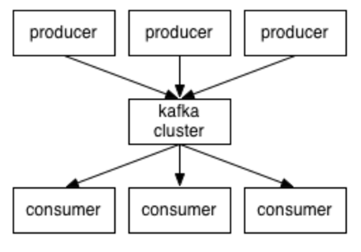

Kafka의 broker는 topic을 기준으로 메시지를 관리한다. Producer는 특정 topic의 메시지를 생성한 뒤 해당 메시지를 broker에 전달한다. Broker가 전달받은 메시지를 topic별로 분류하여 쌓아놓으면, 해당 topic을 구독하는 consumer들이 메시지를 가져가서 처리하게 된다. 이 때 메시지는 key, value, timestamp로 구성되어 있다.

Kafka는 Sale-Out과 High Availability를 위해서 broker들이 클러스터로 동작하게 되어있다. 심지어 한개의 broker만 있어도 클러스터로 동작한다. 클러스터 내의 broker에 대한 분산 처리는 아래의 그림과 같이 Apache ZooKeeper가 담당한다.
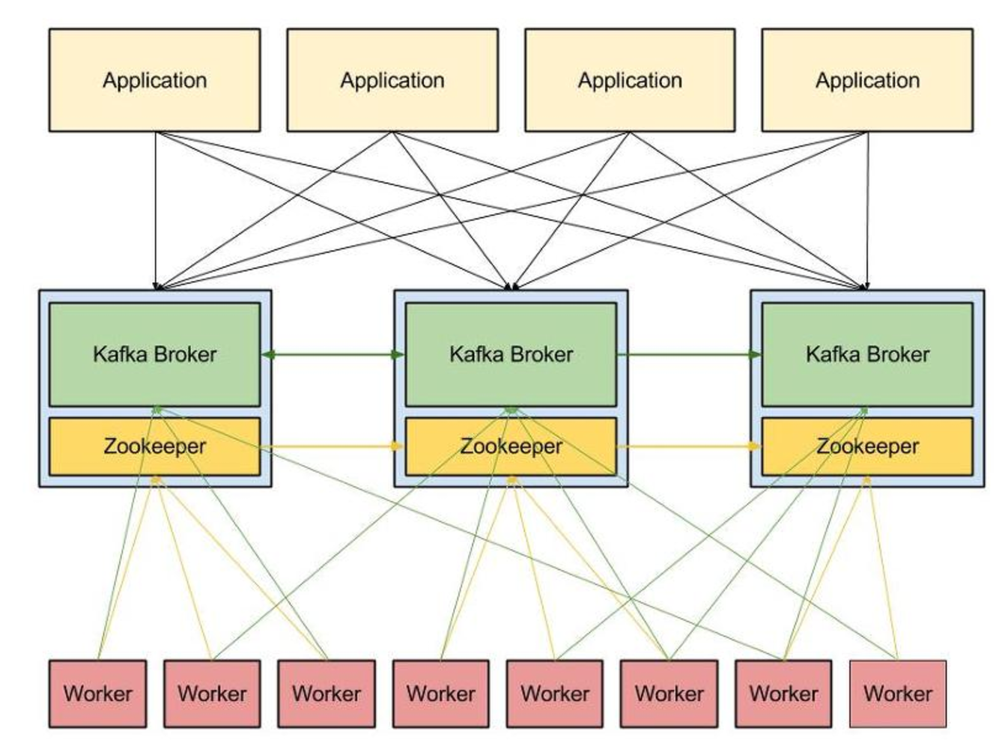

> 한개일 떄는 어떻게 동작하지?

## 기존 메시지 시스템과의 차이점

- 기존 메시지 시스템: ActiveMQ, RabbitMQ

- 대용량의 실시간 로그 처리에 특화되어 설계된 메시징 시스템으로써 기존 범용 메시징 시스템대비 TPS가 매우 우수하다. 단, 특화된 시스템이기 때문에 범용 메시징 시스템에서 제공하는 다양한 기능들은 제공되지 않는다.

- 분산 시스템을 기본으로 설계되었기 때문에, 기존 메시징 시스템에 비해 분산 및 복제 구성을 손쉽게 할 수 있다.

- AMQP 프로토콜이나 JMS API를 사용하지 않고 단순한 메시지 헤더를 지닌 TCP기반의 프로토콜을 사용하여 프로토콜에 의한 오버헤드를 감소시켰다.
> Kafka에서 사용하는 상세한 TCP 프로토콜 형태?

- Producer가 broker에게 다수의 메시지를 전송할 때 각 메시지를 개별적으로 전송해야하는 기존 메시징 시스템과는 달리, 다수의 메시지를 batch형태로 broker에게 한 번에 전달할 수 있어 TCP/IP 라운드트립 횟수를 줄일 수 있다.

- 메시지를 기본적으로 메모리에 저장하는 기존 메시징 시스템과는 달리 메시지를 파일 시스템에 저장한다.

- 파일 시스템에 메시지를 저장하기 때문에 별도의 설정을 하지 않아도 데이터의 영속성(durability)이 보장된다.

  - 기존 메시징 시스템에서는 처리되지 않고 남아있는 메시지의 수가 많을 수록 시스템의 성능이 크게 감소하였으나, Kafka에서는 메시지를 파일 시스템에 저장하기 때문에 메시지를 많이 쌓아두어도 성능이 크게 감소하지 않는다. 또한 많은 메시지를 쌓아둘 수 있기 때문에, 실시간 처리뿐만 아니라 주기적인 batch작업에 사용할 데이터를 쌓아두는 용도로도 사용할 수 있다.

  - Consumer에 의해 처리된 메시지(acknowledged message)를 곧바로 삭제하는 기존 메시징 시스템과는 달리 처리된 메시지를 삭제하지 않고 파일 시스템에 그대로 두었다가 설정된 수명이 지나면 삭제한다. 처리된 메시지를 일정 기간동안 삭제하지 않기 때문에 메시지 처리 도중 문제가 발생하였거나 처리 로직이 변경되었을 경우 consumer가 메시지를 처음부터 다시 처리(rewind)하도록 할 수 있다.

- 기존의 메시징 시스템에서는 broker가 consumer에게 메시지를 push해 주는 방식인데 반해, Kafka는 consumer가 broker로부터 직접 메시지를 가지고 가는 pull 방식으로 동작한다. 따라서 consumer는 자신의 처리능력만큼의 메시지만 broker로부터 가져오기 때문에 최적의 성능을 낼 수 있다.

  - 기존의 push 방식의 메시징 시스템에서는 broker가 직접 각 consumer가 어떤 메시지를 처리해야 하는지 계산하고 어떤 메시지를 처리 중인지 트랙킹하였는데, Kafka에서는 consumer가 직접 필요한 메시지를 broker로부터 pull하므로 broker의 consumer와 메시지 관리에 대한 부담이 경감되었다.

  - 메시지를 pull 방식으로 가져오므로, 메시지를 쌓아두었다가 주기적으로 처리하는 batch consumer의 구현이 가능하다.

## 기존 메시징 시스템과의 성능 비교
Producer 성능
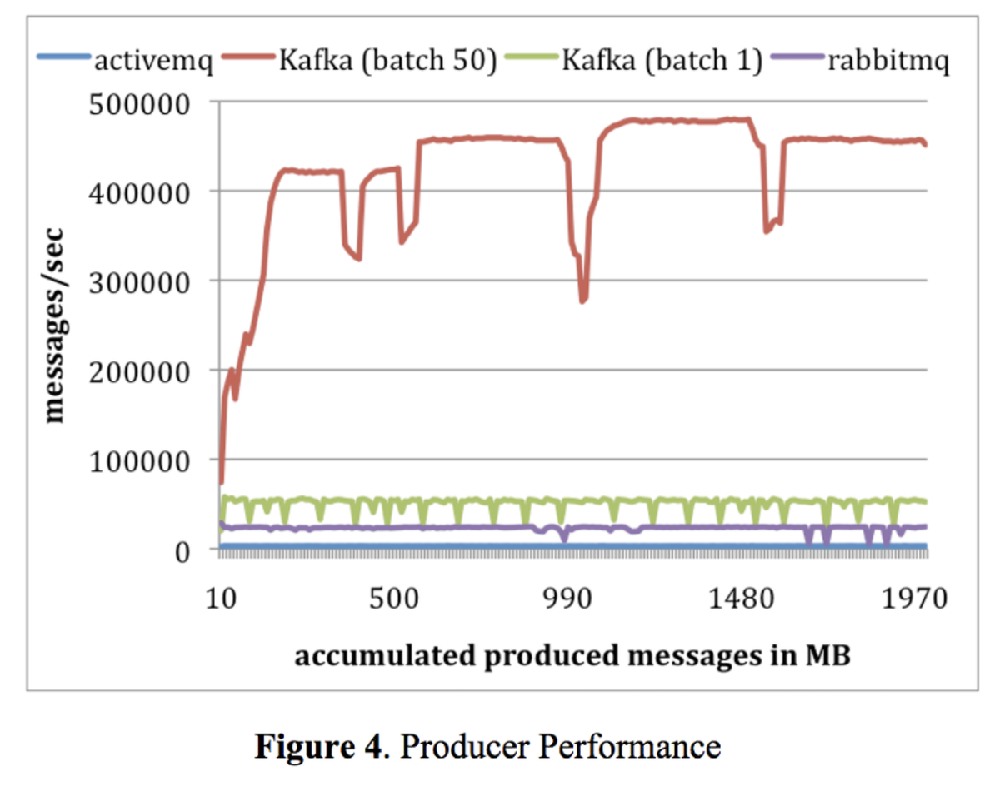
빨간색 그래프는 한 번에 50개씩 batch로 전송한 결과이고, 연두색은 한번에 1개씩 batch로 전송한 결과이다.

> 중간에 한번씩 튀는 이유?

Consumer 성능
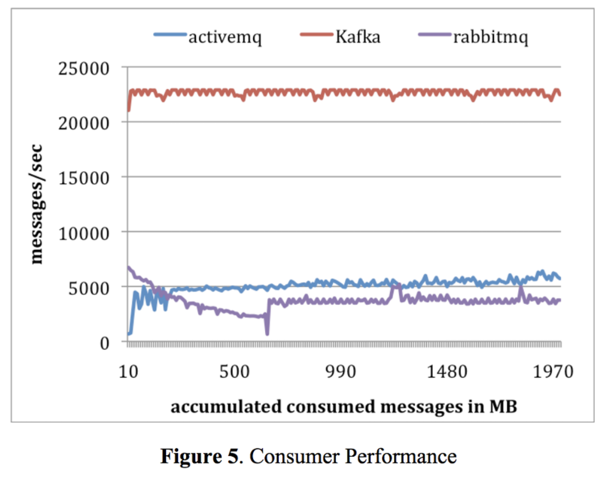

## Topic과 Partition

Kafka의 topic은 partition이라는 단위로 쪼개어져 클러스터의 각 서버들에 분산되어 저장되고, 고가용성을 위하여 복제(replication) 설정을 할 경우 이 또한 partition 단위로 각 서버들에 분산되어 복제되고 장애가 발생하면 partition 단위로 fail over가 수행된다.

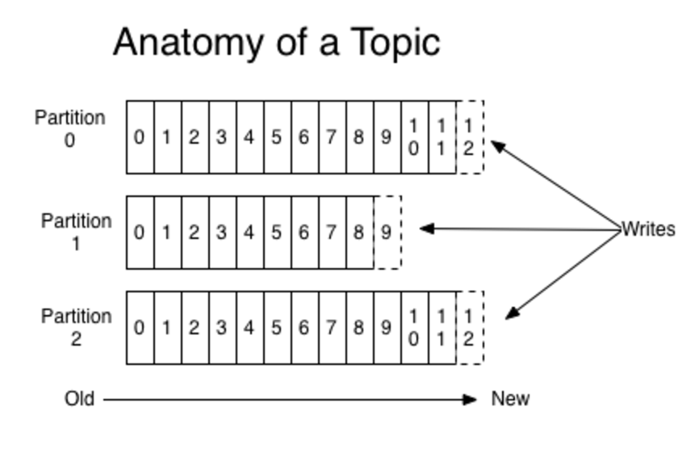

위의 그림은 하나의 topic이 3개의 partition에 분산되어 순차적으로 저장되는 모습을 보여주고 있다.

각 partition은 0부터 1씩 증가하는 offset 값을 메시지에 부여하는데 이 값은 각 partition내에서 메시지를 식별하는 ID로 사용된다. Offset 값은 partition마다 별도로 관리되므로 topic내에서 메시지를 식별할 때는 partition 번호와 offset 값을 함께 사용한다.

### Partition 분산
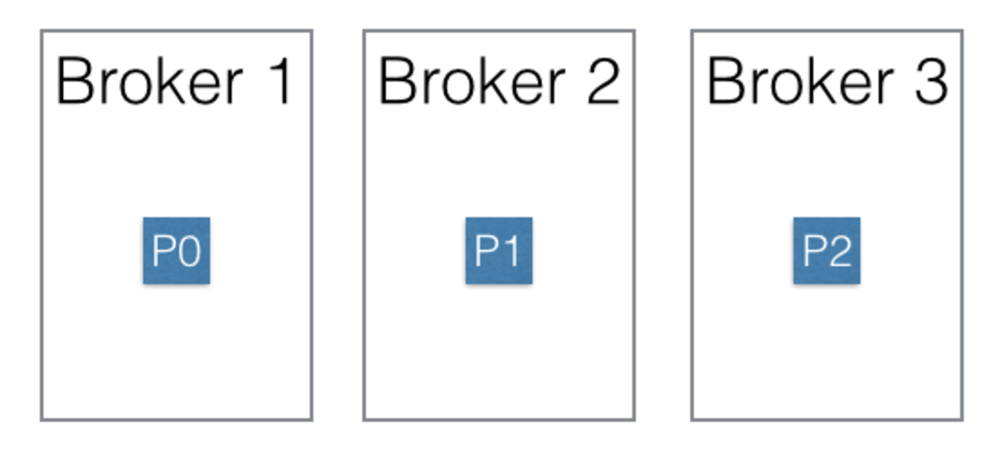

위의 그림에서는 3개의 broker로 이루어진 클러스터에서 하나의 topic이 3개의 partition P0, P1, P2로 분산되어 저장되어 있다.

Producer가 메시지를 실제로 어떤 partition으로 전송할지는 사용자가 구현한 partition 분배 알고리즘에 의해 결정된다. 예를 들어 라운드-로빈 방식의 partition 분배 알고리즘을 구현하여 각 partition에 메시지를 균등하게 분배하도록 하거나, 메시지의 키를 활용하여 알파벳 A로 시작하는 키를 가진 메시지는 P0에만 전송하고, B로 시작하는 키를 가진 메시지는 P1에만 전송하는 형태의 구성도 가능하다.

좀 더 복잡한 예로써 사용자 ID의 CRC32값을 partition의 수로 modulo 연산을 수행하여(CRC32(ID) % partition의 수) 동일한 ID에 대한 메시지는 동일한 partition에 할당되도록 구성할 수도 있다.

### Partition 복제
Kafka에서는 고가용성을 위하여 각 partition을 복제하여 클러스터에 분산시킬 수 있다. 아래의 그림은 해당 topic의 replication factor를 3으로 설정한 상태의 클러스터이다. 각 partition들은 3개의 replica를 가지며 각 replica는 R0, R1, R2로 표시되어 있다.

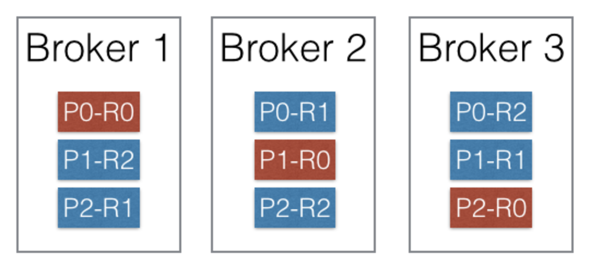

Replication factor를 N으로 설정할 경우 N개의 replica는 1개의 leader와 N-1개의 follower로 구성된다. 위의 그림에서는 각 partition마다 하나의 leader(붉은색)가 존재하며 2개의 follower(푸른색)가 존재한다.

각 partition에 대한 읽기와 쓰기는 모두 leader에서 이루어지며, follower는 단순히 leader를 복제하기만 한다. 만약 leader에 장애가 발생할 경우 follower 중 하나가 새로운 leader가 된다. Kafka의 복제 모델인 ISR 모델은 f+1개의 replica를 가진 topic이 f개의 장애까지 버틸 수 있도록 한다.
> ISR 모델?

Leader에서만 읽기와 쓰기를 수행한다고 하면 부하 분산이 되지 않는다고 생각할 수 있는데, 각 partition의 leader가 클러스터 내의 broker들에 균등하게 분배되도록 알고리즘이 설계되어 있기 때문에 부하는 자연스럽게 분산이 된다. 위의 그림처럼 3개의 broker에 P0, P1, P2의 leader가 균등하게 분배되므로 부하 또한 자연스럽게 분산되게 된다.

### Consumer와 Consumer Group
메시징 모델은 크게 큐(queue) 모델과 발행-구독(publish-subscribe) 모델로 나뉜다. 큐 모델은 메시지가 쌓여있는 큐로부터 메시지를 가져와서 consumer pool에 있는 consumer 중 하나에 메시지를 할당하는 방식이고, 발행-구독 모델은 topic을 구독하는 모든 consumer에게 메시지를 브로드캐스팅하는 방식이다.

Kafka에서는 consumer group이라는 개념을 도입하여 두가지 모델을 발행-구독 모델로 일반화하였다. Kafka의 partition은 consumer group당 오로지 하나의 consumer의 접근만을 허용하며, 해당 consumer를 partition owner라고 부른다. 따라서 동일한 consumer group에 속하는 consumer끼리는 동일한 partition에 접근할 수 없다.

한 번 정해진 partition owner는 broker나 consumer 구성의 변동이 있지 않는한 계속 유지된다. Consumer가 추가/제거되면 추가/제거된 consumer가 속한 consumer group 내의 consumer들의 partition 재분배(rebalancing)가 발생하고 broker가 추가/제거되면 전체 consumer group에서 partition 재분배가 발생한다.

Consumer group을 구성하는 consumer의 수가 partition의 수보다 작으면 하나의 consumer가 여러 개의 partition을 소유하게 되고, 반대로 consumer의 수가 partition의 수보다 많으면 여분의 consumer는 메시지를 처리하지 않게되므로 partition 개수와 consumer 수의 적절한 설정이 필요하다.

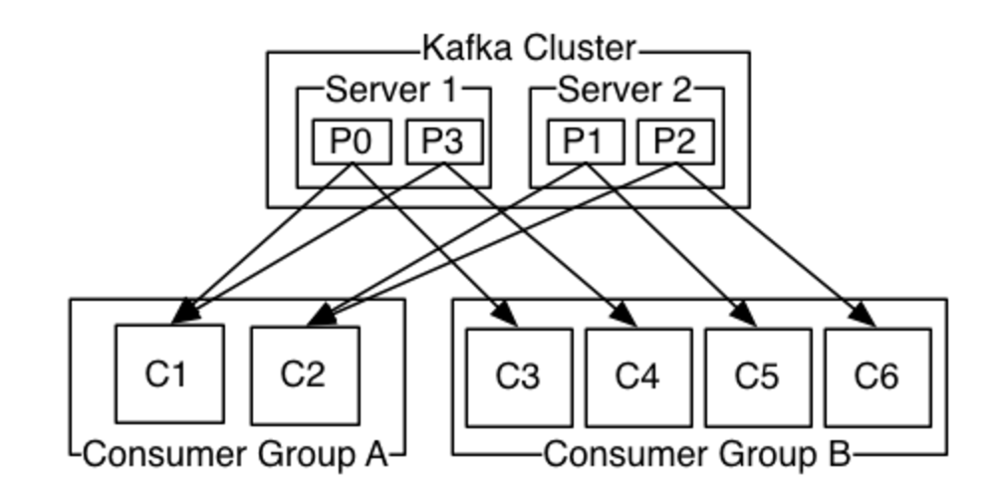

## 파일 시스템을 활용한 고성능 디자인

Kafka는 기존 메시징 시스템과는 달리 메시지를 메모리대신 파일 시스템에 쌓아두고 관리한다.

기존 메시징 시스템에서는 파일 시스템은 메시지의 영속성을 위해서 성능 저하를 감수하면서도 어쩔 수 없이 사용해야하는 애물단지 같은 존재였다. 그러나 Kafka는 이런 편견을 깨고 파일 시스템을 메시지의 주 저장소로 사용하면서도 기존의 메시징 시스템보다 뛰어난 성능을 보여준다.

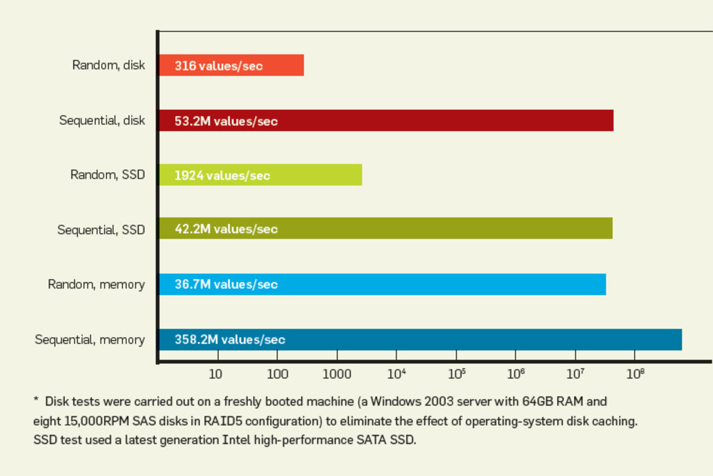

일반적으로 하드디스크는 메모리보다 수백-수천 배 이상 느리다. 그러나 특정 조건에서는 메모리보다 10배 이내로 느리거나 심지어는 빠를 수도 있다. ACM Queue에 게재된 [The Pathologies of Big Data](http://queue.acm.org/detail.cfm?id=1563874)라는 글에 따르면 하드디스크의 순차적 읽기 성능은 메모리에 대한 랜덤 읽기 성능보다 뛰어나며 메모리의 순차적 읽기 성능보다 7배 정도 느리다. (물론 하드디스크의 랜덤 읽기 성능은 메모리의 랜덤 읽기 성능보다 10만배나 느리다.)

### OS로 캐시 관리 위임
Kafka는 메모리에 별도의 캐시를 구현하지 않고 OS의 페이지 캐시에 이를 모두 위임한다. OS가 알아서 서버의 유휴 메모리를 페이지 캐시로 활용하여 앞으로 필요할 것으로 예상되는 메시지들을 미리 읽어들여(readahead) 디스크 읽기 성능을 향상 시킨다.

Kafka의 메시지는 하드디스크로부터 순차적으로 읽혀지기 때문에 하드디스크의 랜덤 읽기 성능에 대한 단점을 보완함과 동시에 OS 페이지 캐시를 효과적으로 활용할 수 있다.

메시지를 파일 시스템에 저장함으로써 얻는 부수적인 효과도 있다.

- 메시지를 메모리에 저장하지 않기 때문에 메시지가 JVM 객체로 변환되면서 크기가 커지는 것을 방지할 수 있고 JVM의 GC로인한 성능저하 또한 피할 수 있다.

- Kafka 프로세스가 직접 캐시를 관리하지 않고 OS에 위임하기 때문에 프로세스를 재시작 하더라도 OS의 페이지 캐시는 그대로 남아있기 때문에 프로세스 재시작 후 캐시를 워밍업할 필요가 없다는 장점도 있다.

### Zero copy 기법

마지막으로 Kafka에서는 파일 시스템에 저장된 메시지를 네트워크를 통해 consumer에게 전송할 때 zero-copy기법을 사용하여 데이터 전송 성능을 향상시켰다.

일반적으로 파일 시스템에 저장된 데이터를 네트워크로 전송할 땐 아래와 같이 커널모드와 유저모드 간의 데이터 복사가 발생하게 된다.

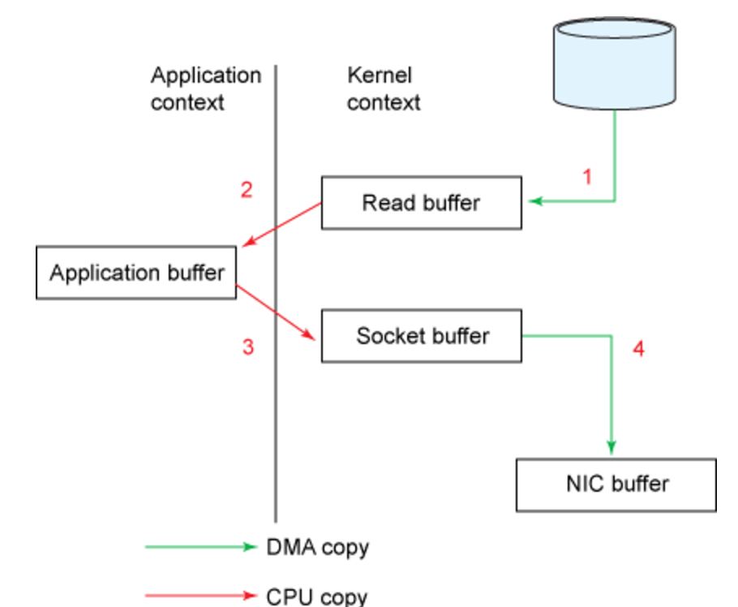

유저모드로 카피된 데이터를 어플리케이션에서 처리한 뒤 처리된 데이터를 네트워크로 전송한다면 위의 그림과 같이 커널모드와 유저모드 간의 데이터 복사는 당연히 필요하다. 그러나 어플리케이션에서의 별도 처리 없이 파일 시스템에 저장된 데이터 그대로 네트워크로 전송만 한다면 커널모드와 유저모드 간의 데이터 복사는 불필요한 것이 된다.

Zero-copy 기법을 사용하면 위에서 언급한 커널모드와 유저모드 간의 불필요한 데이터 복사를 피할 수 있다. 이 기법을 사용하면 아래와 같이 파일 시스템의 데이터가 유저모드를 거치지 않고 곧바로 네트워크로 전송된다. 벤치마크 결과에 따르면 zero-copy를 사용한 경우가 그렇지 않은 경우보다 전송 속도가 2-4배 빠른 것으로 나타났다.

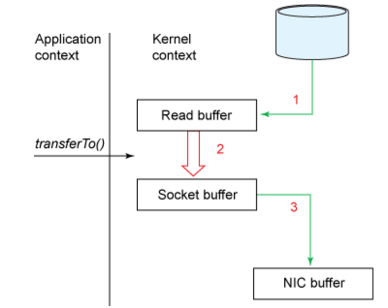

## Reference
http://epicdevs.com/17
http://queue.acm.org/detail.cfm?id=1563874  
http://kafka.apache.org/documentation  
